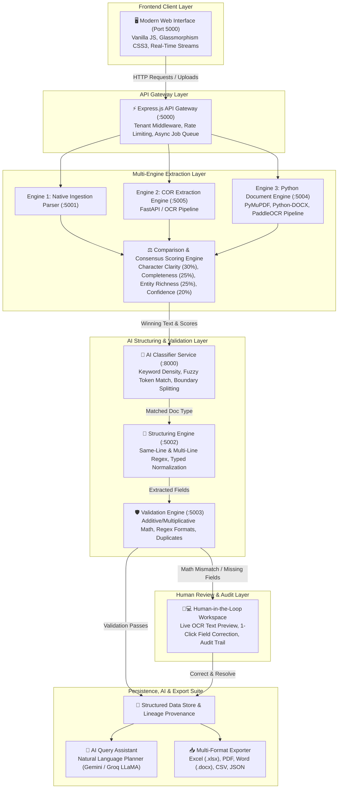

# Enterprise Intelligent Document Processing & Intelligence Platform (IDP)

[](http://localhost:5000)
[](http://localhost:5000/api/v1/health)
[](#multi-engine-extraction--consensus-engine)
[](#security--multi-tenant-isolation)

A production-grade, enterprise-ready **Intelligent Document Processing (IDP)** platform. The system ingests multi-format documents (PDF, Word DOCX, Spreadsheets XLSX/CSV, Images PNG/JPG, and Plain Text), runs parallel extraction across three independent engines, evaluates deterministic consensus scoring, classifies logical sub-document boundaries, structures typed fields according to dynamic user-defined schemas, enforces multi-tier mathematical and business logic validations, routes anomalies to an interactive Human-in-the-Loop Review Workspace, and empowers users with natural language AI query planning and multi-format exports.

---

## Table of Contents
1. [System Architecture](#system-architecture)
2. [Microservice Topology & Port Matrix](#microservice-topology--port-matrix)
3. [End-to-End Ingestion & Processing Pipeline](#end-to-end-ingestion--processing-pipeline)
4. [Multi-Engine Extraction & Consensus Engine](#multi-engine-extraction--consensus-engine)
5. [Dynamic Processing Profiles & Living Schema](#dynamic-processing-profiles--living-schema)
6. [Multi-Tier Automated Validation & Math Integrity](#multi-tier-automated-validation--math-integrity)
7. [Human-in-the-Loop Review Workspace](#human-in-the-loop-review-workspace)
8. [AI Chat Assistant & Restricted Query Planner](#ai-chat-assistant--restricted-query-planner)
9. [Multi-Format Business Reporting & Export Engine](#multi-format-business-reporting--export-engine)
10. [Quick Start & Installation Guide](#quick-start--installation-guide)
11. [REST API Documentation & Payload Examples](#rest-api-documentation--payload-examples)
12. [Automated Verification & Test Suites](#automated-verification--test-suites)
13. [Security & Multi-Tenant Isolation](#security--multi-tenant-isolation)
14. [Troubleshooting & FAQ](#troubleshooting--faq)

---

## System Architecture



---

## Microservice Topology & Port Matrix

The platform runs as a coordinated suite of 7 independent microservices:

| Service Name | Port | Technology Stack | Endpoint / Health Route | Role & Responsibility |
| :--- | :---: | :--- | :--- | :--- |
| **API Gateway & Web UI** | `5000` | Node.js / Express.js | `GET /api/v1/health` | Central API orchestrator, tenant context middleware, job queue dispatch, web app static server. |
| **Extraction Engine 1** | `5001` | Node.js / Express | `GET /health` | Native ingestion and preprocessing extraction parser. |
| **Structure Engine** | `5002` | Python FastAPI | `GET /health` | Key-value schema structuring, layout normalization, and entity binding. |
| **Validation Engine** | `5003` | Python FastAPI | `GET /health` | Format validation, duplicate detection, arithmetic consistency checks, risk scoring. |
| **Extraction Engine 3** | `5004` | Python FastAPI | `GET /health` | High-precision document parser using PyMuPDF (PDFs) and `python-docx` (Word documents). |
| **COR Extraction Engine 2** | `5005` | Python FastAPI | `GET /health` | Independent optical character recognition and visual document parsing. |
| **AI Document Classifier** | `8000` | Python FastAPI | `GET /health` | Document classification, taxonomy matching, multi-page boundary detection. |
| **PostgreSQL Database** | `5433` | PostgreSQL 15 | `localhost:5433` | Relational persistence, field history audit logging, full-text inverted indices. |

---

## End-to-End Ingestion & Processing Pipeline

When a file or batch is uploaded, it transitions through 11 automated stages:

```
[1. Upload & Sanitization] 
         │
[2. Parallel Extraction across Engines 1, 2, 3]
         │
[3. Consensus Scoring & Winner Selection]
         │
[4. Hybrid Taxonomy Classification]
         │
[5. Dynamic Field Structuring & Provenance Capture]
         │
[6. Automated Multi-Tier Validation & Math Audit]
         ├───────────────────────────────────────────┐
         ▼ (Math Mismatch / Missing Fields)          ▼ (All Checks Passed)
[7. Human Review Workspace]                 [8. Auto-Approval to Structured Store]
         │ (Correct & Resolve)                       │
         └───────────────────────────────────────────┤
                                                     ▼
                                            [9. Records & Search]
                                                     │
                                            [10. AI Chat Assistant]
                                                     │
                                            [11. Multi-Format Exports]
```

### Stage Walkthrough:
1. **Upload & Ingestion**: Validates file magic bytes, MIME types, generates SHA-256 checksums, and persists raw files to tenant storage.
2. **Multi-Engine Extraction**: Dispatches raw bytes in parallel to Engine 1, COR Engine 2, and Engine 3.
3. **Consensus Evaluation**: The Comparison Engine scores each engine's output and selects the winning digital text layer.
4. **Classification**: Matches extracted text against profile document types (`supplier_invoice`, `dispatch_manifest`, `material_receipt`, etc.).
5. **Structuring**: Applies same-line (`Key: Value`) and next-line (`Key\nValue`) regex matching to extract defined schema fields.
6. **Validation Engine**: Executes arithmetic assertions (`subtotal + tax = total`, `quantity * unit_price = total`), regex format checks, and duplicate document detection.
7. **Human Review Routing**: Invoices with arithmetic errors or missing mandatory fields automatically route to the Review Workspace with live OCR preview.
8. **Structured Store**: Approved records are stored with full field-level machine vs human provenance and confidence scores.
9. **Search & Indexing**: Instant parametric search and multi-field filtering.
10. **AI Chat Querying**: Natural language aggregations (sums, counts, averages, lookups) without SQL injection vulnerabilities.
11. **Multi-Format Exporting**: Downloads structured datasets in Excel (.xlsx), PDF, Word (.docx), CSV, or JSON.

---

## Multi-Engine Extraction & Consensus Engine

To eliminate single-point-of-failure OCR errors, every document is processed across three engines and evaluated against a **Deterministic 4-Tier Scorecard**:

$$\text{Total Score} = (\text{Clarity} \times 0.30) + (\text{Completeness} \times 0.25) + (\text{Entities} \times 0.25) + (\text{Confidence} \times 0.20)$$

### Scorecard Weights:
1. **Character Clarity (30%)**: Printable character ratio, ASCII/UTF-8 coherence, signal-to-noise ratio.
2. **Information Completeness (25%)**: Token density, word count coverage, and layout volume.
3. **Entity & Business Structure Richness (25%)**: Recognition of currencies, amounts, dates, tax IDs, invoice codes.
4. **Model Native Confidence (20%)**: Underlying OCR model confidence score.

### Comparison Modal in Web UI:
Clicking **`[Compare]`** next to any document displays a real-time side-by-side scorecard breakdown comparing Engine 1, 2, and 3 with character clarity, completeness metrics, and token agreement index.

---

## Dynamic Processing Profiles & Living Schema

The platform requires **zero hardcoded schemas**. Everything is user-configurable via the **Processing Profiles** module:

### Profile Hierarchy:
```
Processing Profile (e.g., "Precision Forge Manufacturing")
  ├── Document Type 1: Commercial Supplier Invoice (supplier_invoice)
  │     ├── invoice_number   [string,  required]
  │     ├── vendor_name      [string,  required]
  │     ├── invoice_date     [date,    required]
  │     ├── subtotal         [decimal, required]
  │     ├── tax_amount       [decimal, required]
  │     ├── total_amount     [decimal, required]
  │     └── purchase_order   [string,  optional]
  │
  ├── Document Type 2: Material Receipt & Inspection Slip (material_receipt)
  │     ├── receipt_number   [string,  required]
  │     ├── vendor_name      [string,  required]
  │     ├── received_date    [date,    required]
  │     ├── purchase_order   [string,  required]
  │     └── inspection_status [string, optional]
  │
  └── Document Type 3: Production Dispatch Manifest (dispatch_manifest)
        ├── manifest_number  [string,  required]
        ├── tracking_number  [string,  required]
        ├── dispatch_date    [date,    required]
        ├── sender_name      [string,  required]
        ├── recipient_name   [string,  required]
        └── total_weight     [string,  required]
```

### Schema Publishing & Immutability:
- Profiles are created in `DRAFT` status.
- Once configured, clicking **"Publish Schema Version"** freezes the schema as an immutable version (e.g. `v1`).
- Documents processed under `v1` retain an immutable reference to that exact schema version.

---

## Multi-Tier Automated Validation & Math Integrity

The **Validation Engine (Port 5003)** runs automated mathematical, formatting, and security assertions:

### 1. Mathematical Balance Validations:
- **Additive Invoice Rule**: $\text{Subtotal} + \text{Tax Amount} == \text{Total Amount}$ (tolerance: $\pm 0.05$)
- **Multiplicative Line Item Rule**: $\text{Quantity} \times \text{Unit Price} == \text{Line Total}$

### 2. Regex Format Validations:
- `invoice_number`: Validates against configured identifier patterns (e.g. `^MFG-INV-\d{4}-\d{4}$` or `^INV-[A-Za-z0-9-]+$`).
- `date` fields: Standardizes and checks valid calendar formats (`YYYY-MM-DD`, `DD/MM/YYYY`).

### 3. Duplicate & Fraud Detection:
- Computes SHA-256 document content hashes and compares field similarity. If an invoice with identical fields or checksum is re-uploaded, it flags: `Probable duplicate document detected (100.0% similarity)`.

---

## Human-in-the-Loop Review Workspace

When a document triggers a math mismatch (`ARITHMETIC_MISMATCH`) or is missing mandatory fields (`REQUIRED_FIELD_MISSING`):

```
┌───────────────────────────────────────────────┬───────────────────────────────────────────────┐
│           DOCUMENT PREVIEW & OCR TEXT         │              CORRECTION CONTROLS              │
├───────────────────────────────────────────────┼───────────────────────────────────────────────┤
│  📄 MFG_2PDF_02_Supplier_Invoice.pdf           │  ROUTING ISSUE: ARITHMETIC_MISMATCH           │
│                                               │                                               │
│  [ LIVE SCROLLABLE OCR TEXT WINDOW ]          │  Field to Adjust: [ Total Amount (total_amount) ▼ ] │
│  INVOICE NUMBER: MFG-INV-2026-9208             │                                               │
│  VENDOR NAME: Nova Industrial Bearings Ltd.   │  Current Machine Value: 241,000.00            │
│  SUBTOTAL: 200,000.00                         │                                               │
│  TAX AMOUNT (18%): 36,000.00                  │  Human Corrected Value: [ 236000.00        ]  │
│  TOTAL AMOUNT: 241,000.00                     │                                               │
│                                               │  [ Save Field Value ]  [ Correct & Revalidate ]│
│  CLICK ANY FIELD TO EDIT:                     │                                               │
│  - vendor_name: Nova Industrial Bearings [✎]  │  ─────────────────────────────────────────── │
│  - subtotal: 200,000.00                  [✎]  │  [ Reject Issue ]     [ Resolve & Resume ✓ ]  │
│  - total_amount: 241,000.00              [✎]  │                                               │
└───────────────────────────────────────────────┴───────────────────────────────────────────────┘
```

### Key Workspace Features:
- **Scrollable Live OCR Text**: Read every line and number directly from the uploaded file.
- **Dynamic Field Selector**: Select any field with 1 click to view machine values and enter corrections.
- **Revalidation**: Click **`Correct & Revalidate`** to re-run automated math checks.
- **1-Click Resolution**: Click **`Resolve & Resume Pipeline ✓`** to approve the record immediately into the structured store.

---

## AI Chat Assistant & Restricted Query Planner

The **AI Chat Assistant (Screen 8)** enables natural language querying over your structured business data with **zero SQL injection risk**:

### Dual-Mode Execution:
1. **`DATA_QUERY`**: Translates natural language questions into restricted, safe query operations (`SUM`, `COUNT`, `AVG`, `MIN`, `MAX`, `FILTER`, `SEARCH`) over the structured JSON records.
2. **`EXPLAIN_PLATFORM`**: Explains system architecture, schema rules, and extraction metrics.

### Example Queries:
- *"What is the total spend across all approved invoices?"*
- *"List all invoices from Omega Machine Tools Pvt. Ltd."*
- *"How many dispatch manifests were processed this month?"*
- *"What is the average tax amount across all supplier bills?"*

---

## Multi-Format Business Reporting & Export Engine

The **Export & Reports (Screen 9)** module generates enterprise-formatted business exports in **5 formats**:

| Format | Library / Engine | Formatting Highlights |
| :--- | :--- | :--- |
| **Excel (`.xlsx`)** | SheetJS (xlsx) | Tabular spreadsheet, styled bold header fill, automatic column width calculation, number cell formats. |
| **PDF Report (`.pdf`)** | PDFKit | Vector-rendered executive document, company header banner, metadata summary box, status badges, zebra-striped data table. |
| **Word (`.docx`)** | docx | Microsoft Word document with executive title, metadata callout container, and styled XML grid tables. |
| **CSV (`.csv`)** | Native Fast-CSV | UTF-8 with BOM, comma-delimited, with automatic CSV formula injection protection (`='` sanitization). |
| **JSON (`.json`)** | Native JSON Engine | Fully structured JSON payload containing document metadata, field lineage, and summary counts. |

---

## Quick Start & Installation Guide

### Prerequisites:
- **Node.js**: `v18+` or `v20+`
- **Python**: `v3.9+` or `v3.10+`
- **Operating System**: Windows, macOS, or Linux

### 1. Clone & Install Backend Dependencies:
```bash
git clone https://github.com/your-org/document-intelligence-platform.git
cd document-intelligence-platform

# Install Node.js dependencies
npm install
```

### 2. Install Python Microservice Dependencies:
```bash
# Install Python requirements
pip install fastapi uvicorn pydantic pymupdf python-docx pyyaml pillow numpy
```

### 3. Launch All Microservices:
You can run all microservices in separate background terminals:

```powershell
# Terminal 1: AI Classifier (Port 8000)
python ai-services/classifier/main.py

# Terminal 2: Extraction Mock (Port 5001)
node teammate-services/extraction-mock/server.js

# Terminal 3: Structure Engine (Port 5002)
python structure_engine/run.py

# Terminal 4: Validation Engine (Port 5003)
python "validation phase/validation phase/validation-engine/main.py"

# Terminal 5: Extraction Engine 3 (Port 5004)
python extraction_engine_3/run.py

# Terminal 6: COR Extraction Engine 2 (Port 5005)
python extraction_engine_2/run.py

# Terminal 7: Express API Gateway & Web UI (Port 5000)
node backend/src/server.js
```

### 4. Open the Web Application:
Open your browser and navigate to:
👉 **`http://localhost:5000`**

---

## REST API Documentation & Payload Examples

All API routes require the `x-organization-id` header for multi-tenant isolation.

### 1. Health & Topology Check
```http
GET /api/v1/health
x-organization-id: 00000000-0000-0000-0000-000000000001
```
**Response (`200 OK` / `207 Multi-Status`):**
```json
{
  "status": "UP",
  "services": {
    "backendGateway": { "status": "UP" },
    "extractionEngine3": { "status": "UP" },
    "classifierService": { "status": "UP" },
    "structuringMock": { "status": "UP" },
    "validationMock": { "status": "UP" }
  }
}
```

---

### 2. Document Upload & Ingestion
```http
POST /api/v1/documents/upload
Content-Type: multipart/form-data
x-organization-id: 00000000-0000-0000-0000-000000000001

Form Data:
- profileId: 5f40bbd2-8bc9-49f5-9417-394efa507ab8
- files: [binary file] (PDF, DOCX, PNG, JPG, XLSX)
```
**Response (`201 Created`):**
```json
{
  "success": true,
  "data": {
    "documentId": "157b20de-f644-4e18-ae3f-9f18d9998e8a",
    "jobId": "77a45133-0644-41ad-88b4-eda6ccafdf0b",
    "filename": "MFG_2PDF_01_Supplier_Invoice_Clean.pdf",
    "status": "QUEUED"
  }
}
```

---

### 3. Fetch Structured Records & Search
```http
POST /api/v1/search/query
Content-Type: application/json
x-organization-id: 00000000-0000-0000-0000-000000000001

{
  "search": "Omega Machine Tools",
  "status": "APPROVED",
  "limit": 20
}
```
**Response (`200 OK`):**
```json
{
  "success": true,
  "results": [
    {
      "structuredRecordId": "bd613e30-08aa-4342-822f-ee8b8c733906",
      "filename": "MFG_2PDF_01_Supplier_Invoice_Clean.pdf",
      "status": "APPROVED",
      "fields": {
        "invoice_number": "MFG-INV-2026-9201",
        "vendor_name": "Omega Machine Tools Pvt. Ltd",
        "invoice_date": "2026-08-27",
        "subtotal": "200,000.00",
        "tax_amount": "36,000.00",
        "total_amount": "236,000.00",
        "purchase_order": "PO-89521"
      }
    }
  ]
}
```

---

### 4. Human Review Field Correction & Resolution
```http
POST /api/v1/reviews/:reviewItemId/field-correction
Content-Type: application/json
x-organization-id: 00000000-0000-0000-0000-000000000001

{
  "sourceFieldKey": "total_amount",
  "correctedValue": "236000.00",
  "rowVersion": 1
}
```

```http
POST /api/v1/reviews/:reviewItemId/resolve
Content-Type: application/json
x-organization-id: 00000000-0000-0000-0000-000000000001

{
  "rowVersion": 2
}
```

---

### 5. Multi-Format Export Generation
```http
POST /api/v1/exports
Content-Type: application/json
x-organization-id: 00000000-0000-0000-0000-000000000001

{
  "format": "XLSX",
  "status": "APPROVED"
}
```
**Response (`200 OK`):**
```json
{
  "success": true,
  "data": {
    "exportId": "efec507a-dc2e-47fa-8de6-3559a7edf5cc",
    "filename": "export_xlsx_1788410046065.xlsx",
    "recordCount": 6,
    "downloadUrl": "/api/v1/exports/efec507a-dc2e-47fa-8de6-3559a7edf5cc/download"
  }
}
```

---

## Automated Verification & Test Suites

The repository contains end-to-end automated testing scripts in the `tests/` directory:

### 1. Master Logical & Parametric 22-Point Audit
Runs a complete validation audit across all 7 microservices, schemas, math mismatch routing, blank document rejection, human review workspace, search, AI chat, and multi-format exports:
```bash
node tests/master_logical_parameters_audit.js
```

### 2. Test All Documents in `Docstest` Folder
Deploys the manufacturing profile and processes all sample PDF, DOCX, and PNG files from `Docstest/`:
```bash
node tests/test_all_docstest_folder.js
```

### 3. Clear All Past Data (Reset State)
Wipes all documents, jobs, reviews, records, and exports for a fresh clean demonstration:
```bash
node tests/clear_all_data.js
```

### 4. Deploy Demo Starter Profile Template
Instantly configures and publishes the `Precision Forge Manufacturing Operations` profile:
```bash
node tests/deploy_docstest_template.js
```

---

## Security & Multi-Tenant Isolation

1. **Strict Organization Scoping**:
   - Every request is tagged via the `x-organization-id` header and validated by `tenantContext.js`.
   - Data stores, search indices, reviews, and storage folders (`storage/organizations/<orgId>/`) are strictly partitioned.
2. **Restricted AI Query Planning**:
   - The AI Assistant never executes dynamic arbitrary SQL. It only generates structured JSON operational AST plans (`SUM`, `COUNT`, `AVG`, `FILTER`) that are executed against tenant-isolated data collections.
3. **CSV Formula Injection Defense**:
   - All exported CSV cells are sanitized against spreadsheet formula execution markers (`=`, `+`, `-`, `@`, `\t`, `\r`).
4. **Optimistic Concurrency Control**:
   - Review workspace corrections require an incremental `rowVersion` integer to prevent race conditions during concurrent reviewer actions.

---

## Troubleshooting & FAQ

### Q1: Why does a clean invoice get marked `APPROVED` without human review?
**Answer**: If a document has high extraction confidence, valid required fields, and passes arithmetic integrity ($\text{Subtotal} + \text{Tax} == \text{Total}$), the automated pipeline approves it straight into the structured store to eliminate manual operator fatigue.

### Q2: Why did an invoice route to `Human Review`?
**Answer**: If an invoice has an intentional math mismatch ($200\text{k} + 36\text{k} \neq 241\text{k}$), missing mandatory fields, or OCR confidence below 75%, it safely routes to the **Human Review Queue** so a human reviewer can verify and correct the number.

### Q3: How do I view the extraction scores across all 3 engines?
**Answer**: Go to **Documents & Jobs** in the navigation and click the **`[Compare]`** button next to any document row.

### Q4: How do I reset the platform for a clean demo?
**Answer**: Run `node tests/clear_all_data.js` or delete all documents from the web dashboard.

---

## License
**Enterprise IDP Platform &bull; Proprietary & Confidential &bull; All Rights Reserved.**
